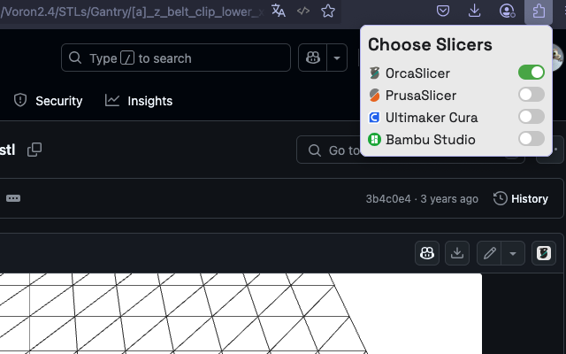

# Github to slicer

[](https://chromewebstore.google.com/detail/github-to-slicer/jomdcljbebhocheinfmkakgobbneconk) [](https://addons.mozilla.org/ru/firefox/addon/github-to-slicer/)

[](https://github.com/pre-commit/pre-commit) [](https://github.com/standard/standard)



Small browser extension to send 3d files to slicers directly from Github

## Installation

### From extension stores

Click appropriate for your browser link above and proceed to installation

### Manual

#### Chrome

Coming soon

#### Firefox

Coming soon

## Development

```bash
pre-commit install
```
